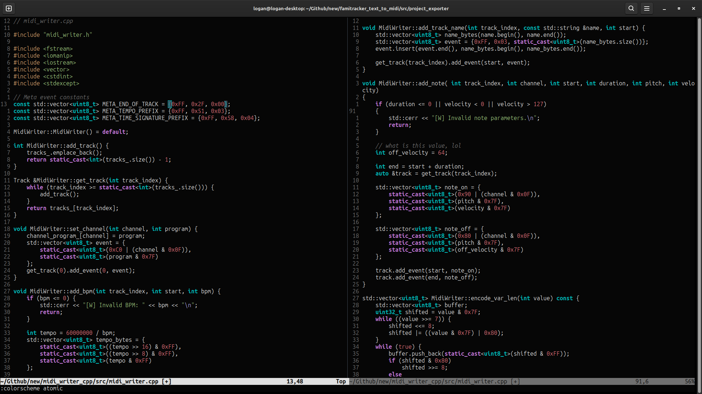
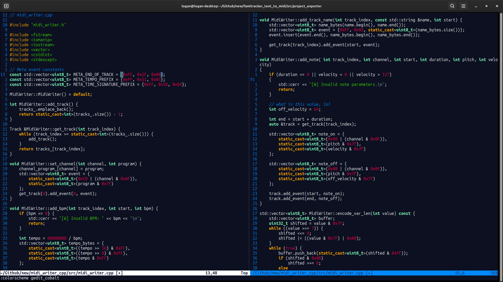
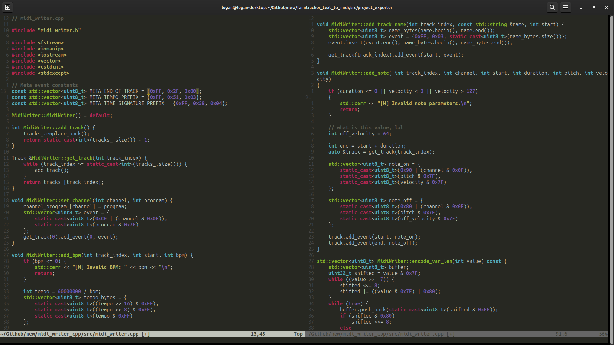
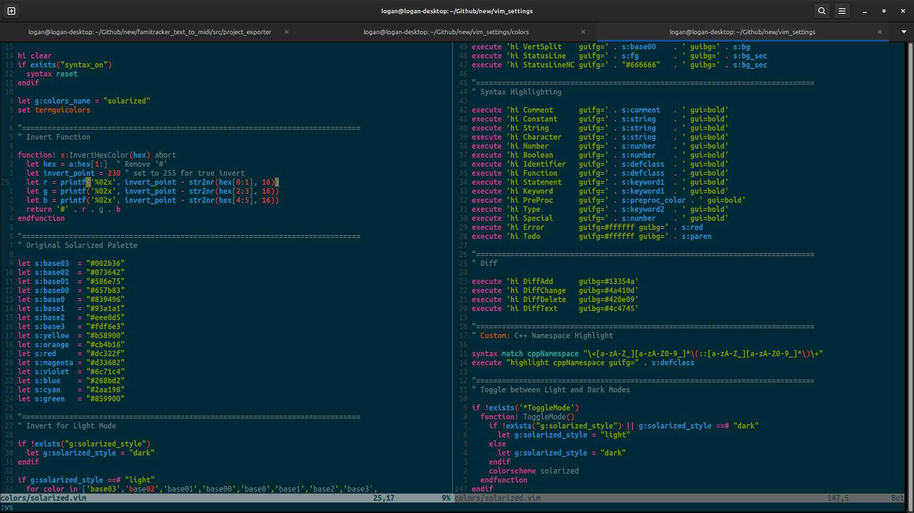
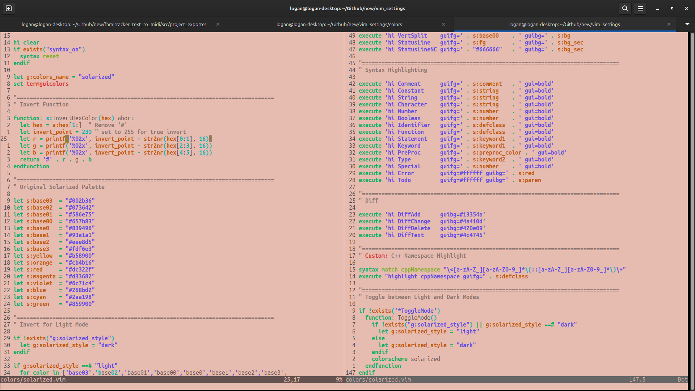
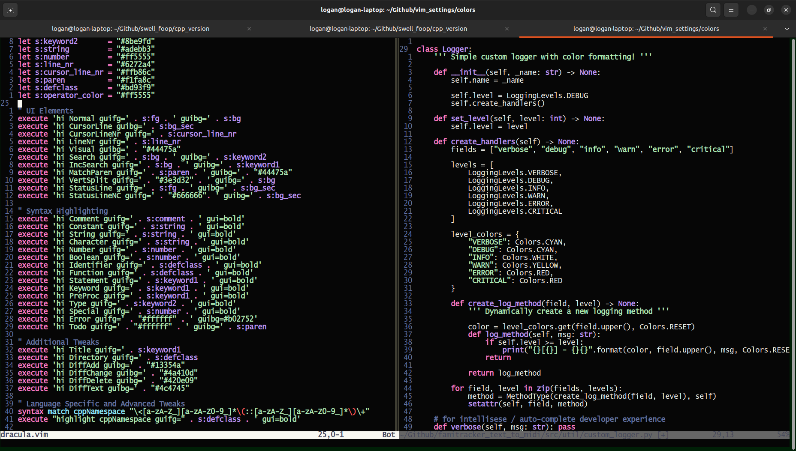

# Vim Settings
* Collection of favorite vim configurations.
* Collection of custom-made colorschemes.

--- 

# Colors Showcase
## Atomic Theme
Inspired by Github dark theme.

## Gedit Cobalt Theme
Recreation of the classic blue theme with orange keywords from Linux Gedit.

## Monokai
Recreation of the Monokai theme from VS Code. Features C++ namespace detection, colors as defclass.

## Solarized Dark
* Recreation of Ethan Schoonover's "solarized" color scheme.
* Contains functions to switch between light and dark mode.
* Toggle between dark and light modes with `:call ToggleMode()`

Solarized Dark mode:

Solarized Light mode:

## Dracula Theme
Recreation of the classic Dracula theme. 

---

# Installation:
* Git clone this repository.
* Place color files inside of your `~/.config/nvim/colors/` directory, or location recognized by Vim.
* Inside of Vim, activate the theme with `colorscheme <new_theme>`.

# License
MIT Standard License.

