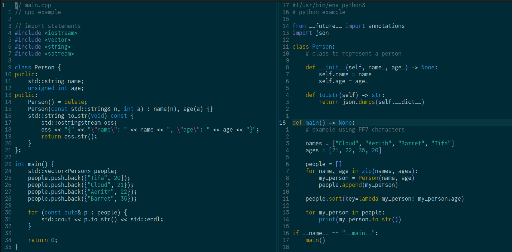
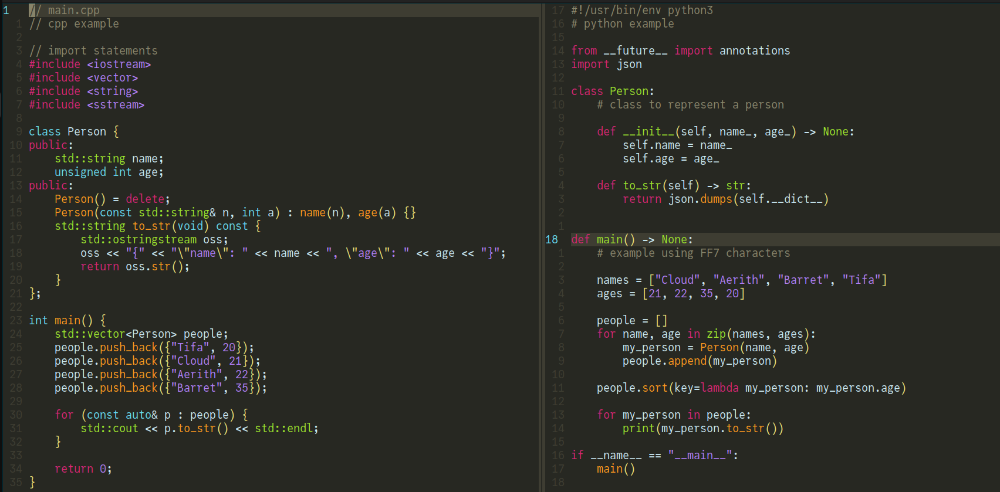
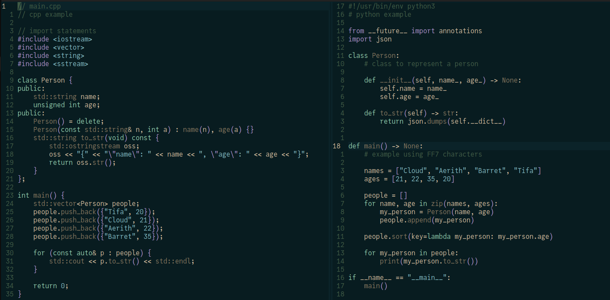
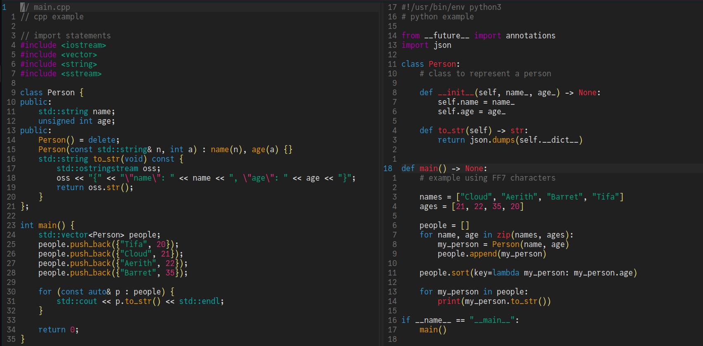
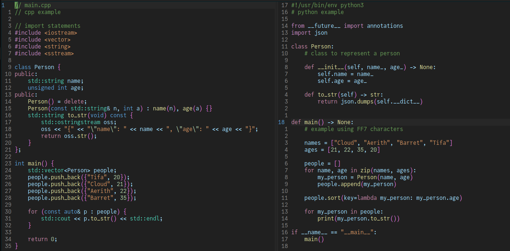

# Vim Settings
* Collection of favorite vim configurations.
* Collection of custom-made colorschemes.

--- 

# Color Showcase

## Gedit Solarized
Theme inspired by Solarized Dark (Linux Gedit variation).

## Monokai Dark
Theme inspired by VSCode Monokai Dark

## Naysayer
Theme inspired by Johnathan Blow's favorite theme.

## OpenAI
Theme inspired by ChatGPT code snippets.

## VSCodeDark
Theme inspired by VSCode's default dark C++ theme.

---

# Installation:
* Git clone this repository.
* Place color files inside of your `~/.config/nvim/colors/` directory, or location recognized by Vim.
* Inside of Vim, activate the theme with `colorscheme <new_theme>`.

# License
The MIT License (MIT)

Copyright (c) 2025 LoganARichey

Permission is hereby granted, free of charge, to any person obtaining a copy
of this software and associated documentation files (the "Software"), to deal
in the Software without restriction, including without limitation the rights
to use, copy, modify, merge, publish, distribute, sublicense, and/or sell
copies of the Software, and to permit persons to whom the Software is
furnished to do so, subject to the following conditions:

The above copyright notice and this permission notice shall be included in
all copies or substantial portions of the Software.

THE SOFTWARE IS PROVIDED "AS IS", WITHOUT WARRANTY OF ANY KIND, EXPRESS OR
IMPLIED, INCLUDING BUT NOT LIMITED TO THE WARRANTIES OF MERCHANTABILITY,
FITNESS FOR A PARTICULAR PURPOSE AND NONINFRINGEMENT. IN NO EVENT SHALL THE
AUTHORS OR COPYRIGHT HOLDERS BE LIABLE FOR ANY CLAIM, DAMAGES OR OTHER
LIABILITY, WHETHER IN AN ACTION OF CONTRACT, TORT OR OTHERWISE, ARISING FROM,
OUT OF OR IN CONNECTION WITH THE SOFTWARE OR THE USE OR OTHER DEALINGS IN
THE SOFTWARE.
