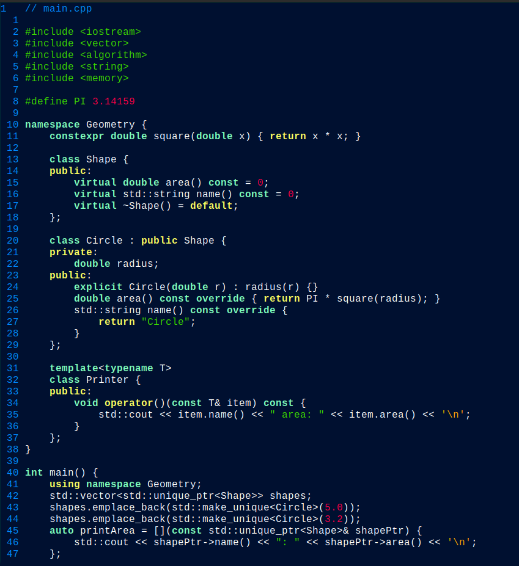
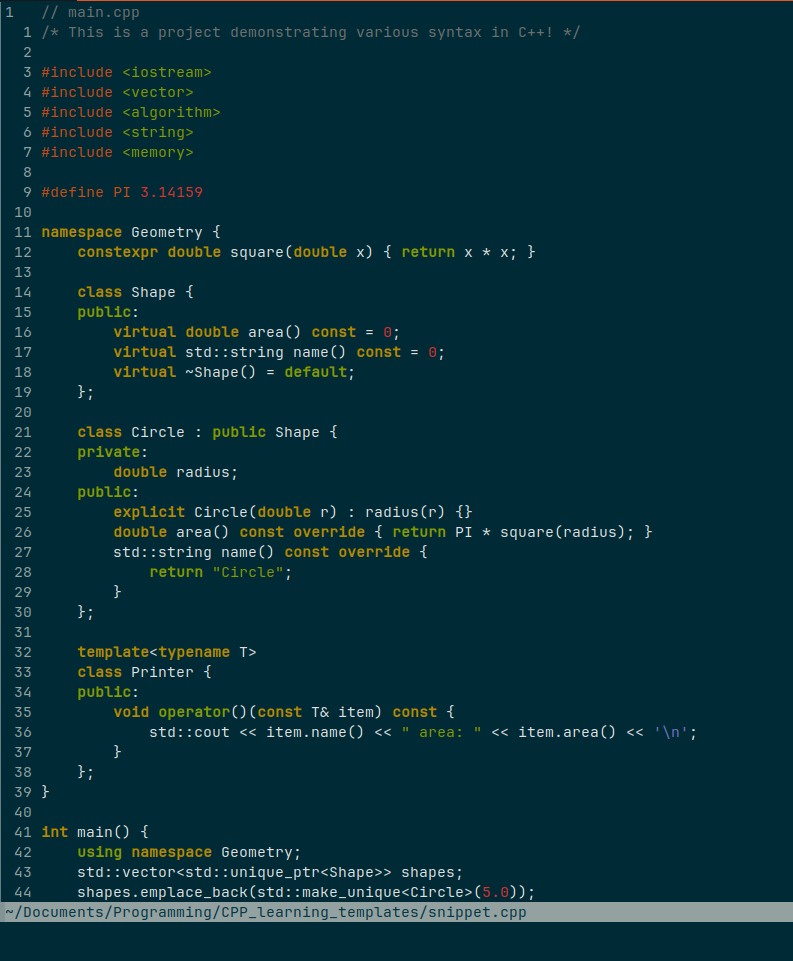

# Vim Settings
* Collection of my favorite Vim/Neovim settings.

## Features
* Minimal `.vimrc` / `init.vim` file with smart tabs.
* Various color themes

## Color Themes
### Gedit Cobalt – Vim/Neovim Theme
Theme inspired by Gedit Cobalt.


### Solarized Dark
Theme modeled after Ethan Schoonover's "solarized" color scheme.


[ ] Toggle between light and dark mode using *(TODO)*
```vim
set background=dark 
set background=light
```

## Installation for color themes
1. Set up colors folder in your vim directory
```bash
mkdir -p ~/.vim/colors
cp gedit_cobalt.vim ~/.vim/colors/
```

2. Inside of `nvim`, activate the theme:
```vim
colorscheme gedit_cobalt
colorscheme solarized
```

## License
MIT

